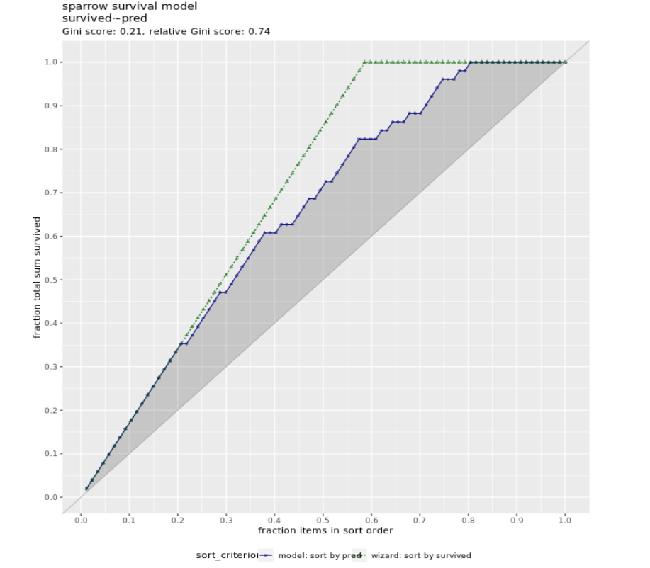
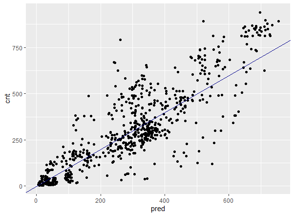
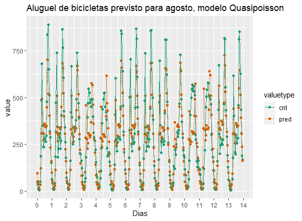
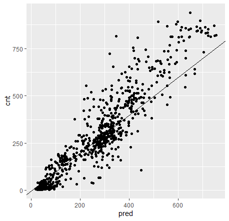
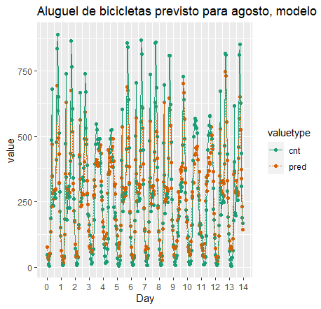

# machine-learning-fundamentals

Repositório com algumas anotações e scripts dos estudos sobre Machine Learning para consulta posterior.


## Por que transformar variáveis de entrada?

Há muitas razões pelas quais você pode querer transformar as variáveis de entrada antes da modelagem. A razão mais importante é que você tem conhecimento de domínio que lhe diz que uma variável transformada pode ser mais informativa. Por exemplo, a inteligência animal está relacionada à razão entre a massa cerebral e a massa corporal em dois terços, e não diretamente à massa cerebral ou corporal. 

Você também pode querer transformar variáveis por motivos pragmáticos, para tornar a variável mais fácil de modelar. A transformação de log para valores monetários é um exemplo disso. Os valores monetários possuem distribuição log-normal, ao aplicarmos log os dados resultantes serão distribuídos normalmente. Um modelo que prevê um resultado logarítmico, geralmente, terá um RMS-erro relativo menor e um RMSE maior. Lembrando que: 

-Erro relativo = (pred/y - 1)   

-RMSE = sqrt(mean(residuals^2))

Ou você pode querer transformar variáveis para atender a suposições de modelagem, como linearidade.

## Compare diferentes modelos 
Existem muitas transformações diferentes da variável que podem nos dar a forma que observamos nos dados. Se tivermos um conhecimento de domínio para preferir um, é assim que devemos escolher. Mas se não sabemos e estamos principalmente preocupados com a previsão precisa, devemos escolher aquela que parece nos dar o menor erro de previsão.

Devemos também validar o desempenho fora da amostra dos modelos, neste caso por validação cruzada. 


## Desafios

Construir um modelo para prever preço a partir de uma medida do tamanho da casa (área de superfície). 

Utilizar o conjunto de dados houseprice. As variáveis são:

-price: preço da casa em unidades de $ 1.000   

-size: área de superfície

Escreva uma fórmula, para expressar o preço em função do quadrado do tamanho. 

Ajuste um modelo e para comparação, ajuste um modelo linear usando a fórmula price ~ size.

Procure fazer previsões a partir dos dados de treinamento dos dois modelos e reúna as previsões em uma única coluna 'pred'.

Compare graficamente as previsões dos dois modelos com os dados. Qual se encaixa melhor?

Como esse conjunto de dados é pequeno, utilize a validação cruzada com a função kWayCrossValidation(). Dica: Você pode definir o 3º e 4º argumentos da função para NULL.


## Regressão logística para prever probabilidades

\strong{Regressão em situação não lineares}

Embora prever se um evento ocorrerá seja um problema de classificação, chamaremos a previsão da probabilidade numérica de que ele ocorra de regressão. No entanto, ao contrário da regressão padrão, as probabilidades só podem estar no intervalo 0-1.

-Prever se um evento ocorrerá (Sim/Não): \strong{classificação}
-Prever probabilidade numérica de que ele ocorra [0-1]: \strong{regressão}
-A regressão linear prever valores no intervalo: [-\infty,+\infty]

A regressão logística assume que as entradas são aditivas e lineares nas probabilidades logarítmicas do resultado, onde as probabilidades são a razão entre a probabilidade de um evento ocorrer e a probabilidade de não ocorrer. 

\begin{equation}
log(p/1-p) = \beta_{0} + \beta_{1}*x1 + \beta_{2}*x2 + ...
\end{equation}

Você ajusta modelos de regressão logística em R com a função glm. A função recebe como entrada uma fórmula, um data.frame e um terceiro argumento chamado family, que descreve a distribuição de erros do modelo; apenas lembre-se que para regressão logística, use family = binomial.

```r
glm(formula, data, family = binomial)
```

Generalized Linear Model (glm) também assume que existem dois resultados possíveis, a e b. O modelo retorna a probabilidade do evento b. Para tornar o modelo mais fácil de entender, recomendamos que você codifique os dois resultados como 0/1 ou FALSE e TRUE.


## Interpretando Modelos de Regressão Logística

Leia os coeficientes de uma regressão logística como você faz para um modelo linear. Se o coeficiente for positivo, então o evento se torna mais provável à medida que esse valor aumenta, se todo o resto for mantido constante.

A função *predict* recebe como entradas o modelo e um dataframe. Para obter as probabilidades, inclua o argumento type = "response".

```r
predict(model, newdata, type = 'response')
```

## Avaliando um modelo de regressão logística: pseudo-$R^2$

O erro quadrado e o RMSE não são boas medidas para modelos de regressão logística. Em vez disso, use desvio e Pseudo-R ao quadrado. Você pode pensar no desvio como sendo semelhante à variância. Pseudo-R-quadrado é análogo ao R-quadrado. Ele compara o desvio de um modelo com o desvio nulo dos dados. \strong{Um bom ajuste fornece pseudo-R quadrado próximo de 1}.


## Pseudo-$R^{2}$ nos dados de treino

Usando o broom::glance:

```r
glance(model) %>% summarize(pseudo_R2 = 1 - deviance / null.deviance)
```

Utilizando o sigr::wrapChiSqTest:

```r
wrapChiSqTest(model) 
```

## Curva de ganhos

Você pode utilizar a função GainCurvePlot() para traçar a curva de ganho das previsões do modelo. Se a curva de ganho do modelo estiver próxima da curva de ganho ideal ("assistente"), então o modelo classificou bem: ou seja, o modelo previu que os eventos que realmente aconteceram teriam maior probabilidade de ocorrência. Exemplo: modelo que prevê a partir das caracteríscas de determinada espécie de ave, quais teriam mais chances de sobrevivência.




Você vê na curva de ganho que o modelo segue a curva do assistente para cerca dos primeiros 30% dos dados, identificando cerca de 45% das aves sobreviventes com apenas alguns falsos positivos.

---

## Regressão de Poisson e Quasi-Poisson para prever contagens

Prever contagens é um problema não linear, porque as contagens são restritas a serem não negativas e inteiros. 

-Linear regression: values predict in [-\infty,+\infty]

-Counts: integers in range [0,+\infty]

A regressão de Poisson também é um modelo linear generalizado. Assume-se que as entradas são aditivas e lineares em relação ao logaritmo do resultado. Em R, você usará novamente a função glm, com family poisson ou quasipoisson.

```r

glm(formula, data, family = poisson)

glm(formula, data, family = quasipoisson)

```
Para a regressão de Poisson, o resultado é um número inteiro que representa uma contagem ou uma taxa, como o número de multas de trânsito que um motorista recebe em um ano ou o número de visitas a um site por dia. 

A regressão de Poisson assume que o processo que produz a contagem tem uma distribuição de Poisson, onde a média é igual à variância ou razoavelmente próximas.  \strong{Para muitos processos da vida real, a variância será bem diferente da média}. Nesse caso, você deve usar a regressão quasipoisson. A regressão de Poisson e quasipoisson funcionam melhor em conjuntos de dados maiores.


##  Exemplo: previsão de aluguel de bicicletas

Temos dados horários de um sistema de compartilhamento de bicicletas em Washington, DC, detalhando o número de bicicletas alugadas durante as primeiras 2 semanas de janeiro. Queremos um modelo para prever as contagens de aluguel de bicicleta por hora em função da hora do dia, do tipo de dia (dia útil, fim de semana ou feriado) e detalhes sobre o clima.

```
O conjunto de dados possui as seguintes colunas:

-'cnt': o número de bicicletas alugadas naquela hora (o resultado)

-'hr': a hora do dia (0-23, como fator)

-'holiday': VERDADEIRO / FALSO

-'workingday': TRUE se não for feriado nem fim de semana, senão FALSE

-'weathersit': categórico, "claro a parcialmente nublado"/"precipitação leve"/"neblina"

-'temp': temperatura normalizada em Celsius

-'atemp': temperatura "sensível" normalizada em Celsius

-'hum': umidade normalizada

-'windspeed': velocidade do vento normalizada

-'instant': o índice de tempo -- número de horas desde o início do conjunto de dados (não uma variável)

-'mnthe' 'yr': índices de mês e ano (não variáveis)

```

-Usaremos os dados de julho para treinamento.

-Como a variância dos aluguéis de bicicletas é muito maior que a média, usaremos a regressão quasipoisson. 

```r
bikesJuly %>% summarise(m = mean(cnt),v = var(cnt))

# mean 273.6653 
# var  45863.84

```
Criando uma fórmula para bicicletas alugadas em função das variáveis explicativas:

```r
outcome = bikesJuly$cnt %>% names()
vars = (bikesJuly %>% names())[1:8]

(fmla <- paste(outcome, "~", paste(vars, collapse = " + ")))

# "cnt ~ hr + holiday + workingday + weathersit + temp + atemp + hum + windspeed"

```
Ajustando o modelo

```r
bike_model <- glm(formula=fmla,data=bikesJuly,family=quasipoisson)
```

Assim como na regressão logística, podemos usar pseudo-R-quadrado para verificar a qualidade do ajuste.

```r
(perf <- glance(bike_model))

# Calculate pseudo-R-squared
(pseudoR2 <- 1 - perf$deviance/perf$null.deviance)

# 0.7842393
```

Vamos testar o modelo usando dados de agosto.

```r
# Make predictions on August data
bikesAugust$pred  <- predict(bike_model,bikesAugust,type='response')

# Calculate the RMSE
bikesAugust %>% 
  mutate(residual = pred-cnt) %>%
  summarize(rmse  = sqrt(mean(residual^2)))
  
# rmse
# 112.5815
```
Visualizando as previsões do modelo de bicicleta usando o gráfico de dispersão padrão "resultado versus previsão":




Como os dados de aluguel de bicicletas são dados de séries temporais, você pode estar interessado em saber como o modelo funciona em função do tempo. A figura a seguir compara as previsões e os aluguéis reais, por hora, para os primeiros 14 dias de agosto.




---

## Modelo Aditivo Generalizado (GAM)

Problema: modelar o peso médio das folhas de uma planta de soja em função do tempo (após o plantio). A planta de soja não cresce a uma taxa constante, mas tem um "surto de crescimento" que eventualmente diminui. Assim, o peso da folha não é bem descrito por um modelo linear.

```r
library(tidyverse)
load("data/Soybean.RData")

# From previous step
library(mgcv)
fmla.gam <- weight ~ s(Time)
model.gam <- gam(fmla.gam, data = soybean_train, family = gaussian)

# Call summary() on model.lin and look for R-squared
summary(model.lin)

# Call summary() on model.gam and look for R-squared
summary(model.gam)

# Call plot() on model.gam
plot(model.gam)

# soybean_test is in the workspace
summary(soybean_test)

# Get predictions from linear model
soybean_test$pred.lin <- predict(model.lin, newdata = soybean_test)

# Get predictions from gam model
soybean_test$pred.gam <- as.numeric(predict(model.gam, newdata = soybean_test))

# Gather the predictions into a "long" dataset
soybean_long <- soybean_test %>%
  gather(key = modeltype, value = pred, pred.lin, pred.gam)

# Calculate the rmse
soybean_long %>%
  mutate(residual = weight - pred) %>%     # residuals
  group_by(modeltype) %>%                  # group by modeltype
  summarize(rmse = sqrt(mean(residual^2))) # calculate the RMSE

# Compare the predictions against actual weights on the test data
soybean_long %>%
  ggplot(aes(x = Time)) +                          # the column for the x axis
  geom_point(aes(y = weight)) +                    # the y-column for the scatterplot
  geom_point(aes(y = pred, color = modeltype)) +   # the y-column for the point-and-line plot
  geom_line(aes(y = pred, color = modeltype, linetype = modeltype)) + # the y-column for the point-and-line plot
  scale_color_brewer(palette = "Dark2")
  
```
# Tree-Based Methods

Neste capítulo, abordaremos dois métodos de ensemble: random forests e gradient boosted trees.

## A intuição por trás dos métodos baseados em árvores

As árvores de decisão aprendem regras da forma "se a e b e c, então y". As árvores podem expressar conceitos não lineares como intervalos e relações não monotônicas e, como AND é semelhante à multiplicação, as árvores podem expressar certos tipos de interações não aditivas.

## Exemplo: prever a inteligência animal a partir do tempo de gestação e tamanho da ninhada

Temos dados sobre o tamanho da ninhada e o tempo de gestação em dias de vários mamíferos. Também temos uma medida da inteligência de cada espécie, dimensionada para que a inteligência humana seja 1. Queremos prever a inteligência a partir do tamanho médio da ninhada e do tempo de gestação de uma espécie. Usaremos uma árvore de decisão.


## Florestas aleatórias (random forests)

Florestas aleatórias tentam resolver os problemas com o modelo de árvore de decisão construindo várias árvores a partir dos dados de treinamento. 

-Usar dados ligeiramente diferentes para construir cada árvore adiciona diversidade aos modelos. 
-A média dos resultados de várias árvores juntas reduz o risco de overfit. 
-Várias árvores também fornecem previsões mais detalhadas do que uma única árvore.
-Cada árvore individual é cultivada a partir de uma amostra aleatória dos dados de treinamento.
-Em uma floresta aleatória, o conjunto de variáveis candidatas a serem consideradas é selecionado aleatoriamente.
-Toda essa randomização confere diversidade ao conjunto de árvores.
-Depois que todas as árvores são cultivadas, o modelo faz uma previsão em um dado passando-o por todas as árvores e calculando a média do resultado.

## Exemplo: dados de aluguel de bicicletas

Retornaremos a um exemplo anterior para prever as taxas de aluguel de bicicletas por hora a partir da hora do dia, do tipo de dia e das condições climáticas. 

Treinaremos um modelo com dados de julho e avaliaremos o modelo com dados de agosto.

Usaremos o pacote ranger para ajustar a floresta aleatória. A função ranger recebe uma fórmula, os dados de treinamento e o número de árvores. Se a variável de resultado for um valor numérico, o ranger fará automaticamente a regressão em vez da classificação. Por padrão, o ranger constrói 500 árvores. Recomendamos que você use pelo menos 200. 

```r
model = ranger::ranger(formula,data,num.trees = 500,respect.unordered.factors = 'order')
```

O argumento *respect.unordered.factors* informa ao ranger como tratar variáveis categóricas. Recomendamos definir esse valor como "order". Isso faz com que o ranger codifique de forma segura e significativa as variáveis categóricas como números. 


```r
load("data/Bikes.RData")

# bikesJuly is in the workspace
str(bikesJuly)

# Random seed to reproduce results
seed = 423563

# The outcome column
(outcome <- "cnt")

# The input variables
(vars <- c("hr", "holiday", "workingday", "weathersit", "temp", "atemp", "hum", "windspeed"))

# Create the formula string for bikes rented as a function of the inputs
(fmla <- paste(outcome, "~", paste(vars, collapse = " + ")))

# Load the package ranger
library(ranger)
library(tidyverse)

# Fit and print the random forest model
(bike_model_rf <- ranger(fmla, # formula 
                         bikesJuly, # data
                            num.trees = 500, 
                            respect.unordered.factors = 'order', 
                            seed = seed))

# Ranger result
# 
# Call:
#   ranger(fmla, bikesJuly, num.trees = 500, respect.unordered.factors = "order",      seed = seed) 
# 
# Type:                             Regression 
# Number of trees:                  500 
# Sample size:                      744 
# Number of independent variables:  8 
# Mtry:                             2 
# Target node size:                 5 
# Variable importance mode:         none 
# Splitrule:                        variance 
# OOB prediction error (MSE):       8230.568 
# R squared (OOB):                  0.8205434 

# bikesAugust is in the workspace
str(bikesAugust)

# bike_model_rf is in the workspace
bike_model_rf

# Make predictions on the August data
bikesAugust$pred <- predict(bike_model_rf, bikesAugust)$predictions

# Calculate the RMSE of the predictions
bikesAugust %>% 
  mutate(residual = pred - cnt)  %>% # calculate the residual
  summarize(rmse  = sqrt(mean(residual^2)))      # calculate rmse

# rmse
# 97.18347

first_two_weeks <- bikesAugust %>% 
  # Set start to 0, convert unit to days
  mutate(instant = (instant - min(instant)) / 24) %>% 
  # Gather cnt and pred into a column named value with key valuetype
  gather(key = valuetype, value = value, cnt, pred) %>%
  # Filter for rows in the first two
  filter(instant < 14) 

# Plot predictions and cnt by date/time 
first_two_weeks %>% ggplot(aes(x = instant, y = value, color = valuetype, linetype = valuetype)) + 
  geom_point() + 
  geom_line() + 
  scale_x_continuous("Day", breaks = 0:14, labels = 0:14) + 
  scale_color_brewer(palette = "Dark2") + 
  ggtitle("Aluguel de bicicletas previsto para agosto, modelo Random Forest")
  
```


Esse modelo de floresta aleatória supera o modelo de poisson (visto anteriormente) nos mesmos dados, em termos de RMSE; Isto é, é capaz de descobrir relações não lineares ou não aditivas mais complexas nos dados. 

Além disso, O modelo de floresta aleatória capturou as variações diárias na demanda de pico 
melhor do que o modelo quasipoisson, mas ainda subestima a demanda de pico e também
superestima a demanda mínima. Portanto, ainda há espaço para melhorias.




## Variáveis categóricas: One-Hot-Encoding

A maioria das funções de modelagem em R faz um ótimo trabalho de gerenciamento de variáveis categóricas, então normalmente você não precisa se preocupar com isso. No entanto, nem todas as linguagens de programação fazem isso. 

O xgboost, um pacote que vem originalmente do Python, não aceita diretamente variáveis categóricas; Estas devem ser convertidas em alguma representação numérica. Em Python, essa conversão é chamada de *one-Hot-Encoding*.

Usaremos o pacote vtreat para codificar variáveis categóricas de uma só vez. Como efeito colateral, o vtreat também limpa os valores ausentes em dados categóricos e numéricos. A ideia básica é projetar um plano de tratamento a partir dos dados de treinamento usando a função designTreatmentsZ. Este plano de tratamento registra as etapas necessárias para codificar com segurança não apenas os dados de treinamento, mas também os dados futuros. A função *prepare* converte os dados de treinamento e futuros em uma forma compatível com xgboost: todas as variáveis numéricas, sem valores ausentes.


