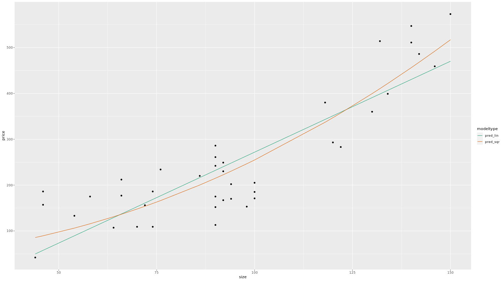

machine-learning-fundamentals
===============

Repositório com algumas anotações, reflexões, scripts dos estudos sobre Machine Learning para consulta posterior.

## Por que transformar variáveis de entrada?

Há muitas razões pelas quais você pode querer transformar as variáveis de entrada antes da modelagem. A razão mais importante é que você tem conhecimento de domínio que lhe diz que uma variável transformada pode ser mais informativa. Por exemplo, a inteligência animal está relacionada à razão entre a massa cerebral e a massa corporal em dois terços, e não diretamente à massa cerebral ou corporal. 

Você também pode querer transformar variáveis por motivos pragmáticos, para tornar a variável mais fácil de modelar. A transformação de log para valores monetários é um exemplo disso. Os valores monetários possuem distribuição log-normal, ao aplicarmos log os dados resultantes serão distribuídos normalmente. Um modelo que prevê um resultado logarítmico, geralmente, terá um RMS-erro relativo menor e um RMSE maior. Lembrando que: 

-Erro relativo = (pred/y - 1)   

-RMSE = sqrt(mean(residuals^2))

Ou você pode querer transformar variáveis para atender a suposições de modelagem, como linearidade.

## Compare diferentes modelos 
Existem muitas transformações diferentes da variável que podem nos dar a forma que observamos nos dados. Se tivermos um conhecimento de domínio para preferir um, é assim que devemos escolher. Mas se não sabemos e estamos principalmente preocupados com a previsão precisa, devemos escolher aquela que parece nos dar o menor erro de previsão.

Devemos também validar o desempenho fora da amostra dos modelos, neste caso por validação cruzada. 


## Desafios

Construir um modelo para prever preço a partir de uma medida do tamanho da casa (área de superfície). 

Utilizar o conjunto de dados houseprice. As variáveis são:

-price: preço da casa em unidades de $ 1.000   

-size: área de superfície

Escreva uma fórmula, para expressar o preço em função do quadrado do tamanho. 

Ajuste um modelo e para comparação, ajuste um modelo linear usando a fórmula price ~ size.

Procure fazer previsões a partir dos dados de treinamento dos dois modelos e reúna as previsões em uma única coluna 'pred'.

Compare graficamente as previsões dos dois modelos com os dados. Qual se encaixa melhor?

Como esse conjunto de dados é pequeno, utilize a validação cruzada com a função kWayCrossValidation(). Dica: Você pode definir o 3º e 4º argumentos da função para NULL.




## Regressão logística para prever probabilidades

\strong{Regressão em situação não lineares}

Embora prever se um evento ocorrerá seja um problema de classificação, chamaremos a previsão da probabilidade numérica de que ele ocorra de regressão. No entanto, ao contrário da regressão padrão, as probabilidades só podem estar no intervalo 0-1.

-Prever se um evento ocorrerá (Sim/Não): \strong{classificação}
-Prever probabilidade numérica de que ele ocorra [0-1]: \strong{regressão}
-A regressão linear prever valores no intervalo: [-\infty,+\infty]

A regressão logística assume que as entradas são aditivas e lineares nas probabilidades logarítmicas do resultado, onde as probabilidades são a razão entre a probabilidade de um evento ocorrer e a probabilidade de não ocorrer. 

\begin{equation}

log(p/1-p) = \beta_{0} + \beta_{1}*x1 + \beta_{2}*x2 + ...

\end{equation}

Você ajusta modelos de regressão logística em R com a função glm. A função recebe como entrada uma fórmula, um data.frame e um terceiro argumento chamado family, que descreve a distribuição de erros do modelo; apenas lembre-se que para regressão logística, use family = binomial.

```r
glm(formula, data, family = binomial)
```

Generalized Linear Model (glm) também assume que existem dois resultados possíveis, a e b. O modelo retorna a probabilidade do evento b. Para tornar o modelo mais fácil de entender, recomendamos que você codifique os dois resultados como 0/1 ou FALSE e TRUE.


## Interpretando Modelos de Regressão Logística

Leia os coeficientes de uma regressão logística como você faz para um modelo linear. Se o coeficiente for positivo, então o evento se torna mais provável à medida que esse valor aumenta, se todo o resto for mantido constante.

A função *predict* recebe como entradas o modelo e um dataframe. Para obter as probabilidades, inclua o argumento type = "response".

```r
predict(model, newdata, type = 'response')
```

## Avaliando um modelo de regressão logística: pseudo-$R^2$

O erro quadrado e o RMSE não são boas medidas para modelos de regressão logística. Em vez disso, use desvio e Pseudo-R ao quadrado. Você pode pensar no desvio como sendo semelhante à variância. Pseudo-R-quadrado é análogo ao R-quadrado. Ele compara o desvio de um modelo com o desvio nulo dos dados. \strong{Um bom ajuste fornece pseudo-R quadrado próximo de 1}.


## Pseudo-$R^{2}$ nos dados de treino

Usando o broom::glance:

```r
glance(model) %>% summarize(pseudo_R2 = 1 - deviance / null.deviance)
```

Utilizando o sigr::wrapChiSqTest:

```r
wrapChiSqTest(model) 
```


